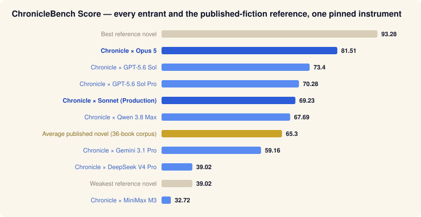

# ChronicleBench

[](LICENSE)
[](LICENSE)
[](docs/PROTOCOL.md)
[](https://bench.chronicle.town)

**An open, preregistered benchmark for sustained long-form generation: can an AI system
deliver a complete, commissioned novel — and how good is it, measured against published
fiction on one pinned instrument?**

Built by [Chronicle](https://chronicle.town), which also competes in it — read that
disclosure as a reason to check our work, not to take our word. Everything needed to
audit, reuse, or enter the benchmark is in this repository; Chronicle's generation
engine is proprietary and deliberately **not** here.



*Blue = AI entrants (one row per model; `Chronicle ×` system entries run the full
engine, the rest ran the neutral harness in this repo). Gold = the mean of the 36-novel
published reference corpus. All rows: identical instrument, identical five-window
protocol. Regenerate with `python tools/make_chart.py`.*

## The problem this benchmark measures

Frontier models write excellent prose. Handed the commission *"write a complete
80–90,000-word novel"* and left alone, the twelve models in the v1.1 cohort stopped at
a **median of ~13,000 words** — and 4 of 12 never reached novel length even with a
continuation harness pushing them. Long-form generation has two failure modes that
passage-level benchmarks cannot see:

1. **Non-completion** — stalls, grinds, refusals, or overshoot far from the commission.
2. **Positional decay** — quality that collapses in the late book, hidden by strong
   openings.

ChronicleBench measures both: eligibility requires a delivered 80–95K-word novel, and
the score is the mean of **five positional 10,000-word windows** (opening / 25K / 50K /
75K / ending), each judged independently — a weak ending drags the score exactly as
much as a weak opening.

## The instrument: OBR

Every number on the board comes from **OBR (Objective Book Review)** — Chronicle's
book-evaluation instrument, pinned at version `obr-v2.1-2026-03-08` for the entire
cohort. In one sentence: an 8-dimension, evidence-cited literary rubric (weights
published), judged by Claude Sonnet 4.6 at temperature 0, three independent runs per
text, median-aggregated, with a deterministic metric layer as cross-check. The full
specification — dimensions, anchors, weights, evidence rules, caps, aggregation, and
disclosed limitations (including that the judge shares a base model with entrants) —
is in [`docs/METHODOLOGY.md`](docs/METHODOLOGY.md). A faithful, self-contained
reference implementation of the rubric layer ships in [`instrument/`](instrument/).

## Headline results (v1.1 cohort + system entries, September 2026)

| Entrant | Score | Endings | Basis |
|---|---|---|---|
| **Chronicle × Opus 5** | **81.5** | 82.7 | full engine, preregistered model swap — every commissioned novel delivered |
| GPT-5.6 Sol | 73.4 | 66.2 | neutral harness |
| GPT-5.6 Sol Pro | 70.3 | — | neutral harness |
| **Chronicle × Sonnet (Production)** | **68.3** | 64.6 | full production engine, end-to-end |
| Qwen 3.8 Max | 67.7 | — | neutral harness |
| **Published reference (36 novels)** | **median 64.3 / mean 65.3** | — | Gutenberg corpus, seeded selection |
| Gemini 3.1 Pro | 59.2 | — | neutral harness (2 eligible) |
| 4 of 12 models | DNS | — | never sustained novel length |

The headline finding: **bare Opus 5 finished 3 of 12 novel attempts; inside a complete
generation system it delivered 6 of 6 at the ~92nd percentile of published fiction** —
completion is a systems problem, prose quality is a model property, and the two are
separable. Full per-run data, including every failure: [`data/`](data/).

## Replicate it

### A. Score any manuscript (≈ $2, ~10 minutes)

```bash
pip install anthropic && export ANTHROPIC_API_KEY=...
python instrument/cut_windows.py my-novel.txt out/ 10000        # five windows
for w in opening 25k 50k 75k ending; do
  python instrument/score.py "out/my-novel--$w.txt" --genre "science fiction"
done
# ChronicleBench Score = mean of the five composite_score values
```

### B. Run a model as an entrant (cost depends on the model)

```bash
pip install requests && export OPENROUTER_API_KEY=...
python harness/sustained_run.py --model anthropic/claude-sonnet-4.6 \
  --brief data/briefs/B2.txt --genre "science fiction"
```

The harness is the frozen v1.1 entrant protocol verbatim: commission template, neutral
`CONTINUE` on every stop, per-call offsets recorded, 94K hard cap. Template and
continuation hashes are written into every manifest so runs are comparable. A full
cohort entry is 2 briefs × 3 sustained + 3 free-run replicates — see
[`CONTRIBUTING.md`](CONTRIBUTING.md); partial cohorts don't board.

### C. Reproduce the published numbers

- All published scores, window-by-window and run-by-run:
  [`data/benchmark-v1.1.json`](data/benchmark-v1.1.json) and
  [`data/runs-v1.1.csv`](data/runs-v1.1.csv); system entries in
  [`data/chronicle-x-opus.json`](data/chronicle-x-opus.json) and
  [`data/chronicle-x-sonnet.json`](data/chronicle-x-sonnet.json).
- The human corpus is reconstructible: Gutenberg IDs, strata, seed string and
  manuscript SHA-256 hashes were committed **before scoring** —
  [`data/gutenberg-selection-manifest.json`](data/gutenberg-selection-manifest.json).
- Re-scoring with `instrument/score.py` reproduces the rubric layer; official board
  numbers come from the pinned internal instrument (adds deterministic cross-checks
  and caps). Expect small differences; label which implementation you used. Judge
  nondeterminism is damped by temperature 0 + 3-run medians (observed window medians
  are stable to roughly ±2 points).

## Integrity properties

- **Preregistered**: protocol, briefs, roster, eligibility and scoring frozen before
  generation; changes only by numbered public amendments
  ([protocol page](https://bench.chronicle.town/protocol-v1.1.html) carries all of
  them, including budget aborts and the reliability extension).
- **One instrument, everything**: the same pinned OBR judges every AI window and every
  human reference novel.
- **Publish-all**: DNFs, stalls, refusals, withdrawn models and the operator's own
  losses stay on the record. No selective reruns.
- **Conflict disclosed**: the benchmark's operator competes in it. The controls that
  make that workable: the human-corpus percentile framing, the architecture-control
  rows, preregistration, and this repository.

## Repository map

| Path | Contents |
|---|---|
| [`docs/PROTOCOL.md`](docs/PROTOCOL.md) | Frozen v1.1 cohort protocol + amendment discipline + how any model gets added |
| [`docs/METHODOLOGY.md`](docs/METHODOLOGY.md) | OBR in full: layers, rubric, weights, aggregation, limitations |
| [`instrument/`](instrument/) | `cut_windows.py` (positional cutter) · `score.py` (reference OBR rubric scorer) |
| [`harness/`](harness/) | `sustained_run.py` — the neutral entrant harness, frozen template verbatim |
| [`data/`](data/) | Complete published results, briefs, human-corpus manifest |
| [`tools/`](tools/) | Chart generation for this README |

## Citation

```
ChronicleBench v1.1 (2026). Chronicle. https://bench.chronicle.town
Data & protocol: https://github.com/mmaier88/chroniclebench
```

## License

Code: MIT · Data & documentation: CC BY 4.0.
